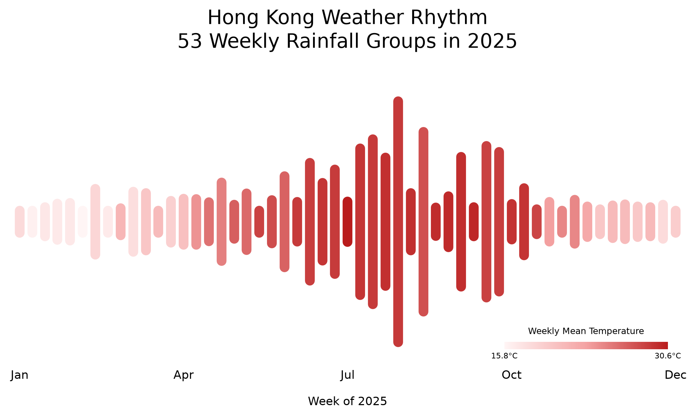

## Hong Kong Weather Rhythm: Rainfall and Temperature in 2025

<!-- This is the SD5913 assignment 2 template. Everything in this file is yours to
replace, and the check counts words: comments like this one are not words, so
delete each one as you write. Start with the heading: name the phenomenon.

Then, in this order, at least 150 words in total.

New to folders, paths, or the files here whose names start with a dot? Read
https://github.com/sd5913/pfad/blob/2026/reference/files.md first. Ten minutes. -->

## The phenomenon

Hong Kong has a subtropical climate, with noticeable seasonal changes in temperature and rainfall. I wanted to explore how these two weather phenomena change throughout a year and how they can be represented together in a single visualisation.

I chose to transform the data into a visual rhythm. Each week becomes a vertical line, and the changing lengths and colours create a waveform that represents Hong Kong's weather throughout 2025.

## The source

The data comes from the Hong Kong Observatory's official open data service.

Temperature: Daily Mean Temperature (°C) at the Hong Kong Observatory, 2025.
Rainfall: Daily Total Rainfall (mm) at the Hong Kong Observatory, 2025.

I used 365 daily records for each weather variable and grouped them into 53 weeks. The first 52 periods contain seven days each, while the final period contains only December 31.

The original CSV files are stored in the data/ folder.

## What the picture shows

The visualisation contains 53 vertical lines arranged from left to right.

The length of each line represents the total rainfall during that period, while its colour represents the average temperature. A deeper red indicates a warmer week, and a lighter red indicates a cooler week.

Rainfall values are transformed using a square-root scale to reduce the visual dominance of extreme rainfall. (I tried serval times. If not doing that, the peak would be extremely high. It makes chart strange.)

## Run it

Run the following command to generate the final visualisation:

uv run weather_garden.py

The resulting image is saved to out/weather-rhythm-2025.png.